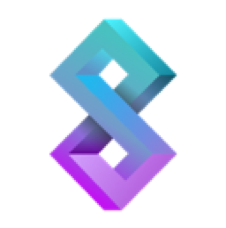
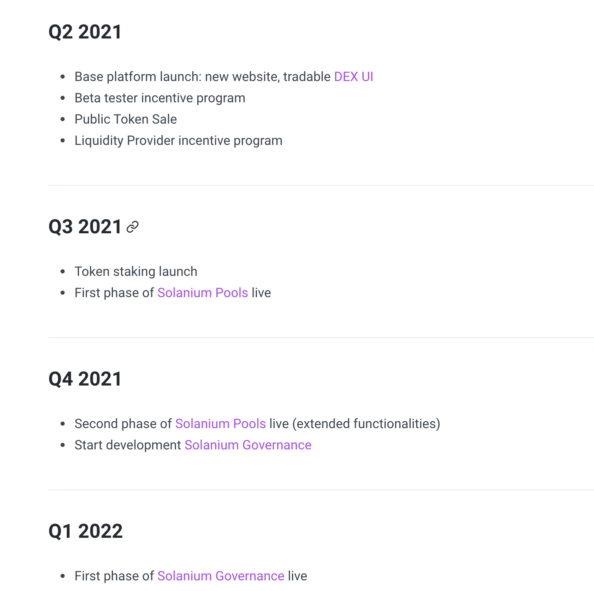

# **Solanium: Launchpad To The Moon**

By Rahul Nandwani June 10th 2021

ICO, IDO, Confusing-O. Raising money in crypto has never been a walk in the park. The manner in which crypto projects conduct fundraising is evolving. With the rising tide of the crypto industry being legitimized by institutions, new protocols are turning to crypto launchpads to raise funds. Crypto launchpads are decentralising cryptocurrency investment by offering a large number of individuals early access. They are a vehicle for new ventures to obtain funds while also giving investors previews to token sales. These previews grant early access to invest in these tokens at a discounted price, prior to being released for the market. Additionally, crypto launchpad initiatives also aid in the development of a project's ecosystem. Furthermore, these communities frequently interweave, resulting in a network effect.

Crypto launchpads offer a plethora of advantages for projects. Launchpads nearly instantaneously add a veneer of reputability to projects keen on listings. Retail investors and market players who are already acquainted with crypto launchpads may conclude a new token released through a credible launchpad holds a certain level of potential. The process of releasing a project can be costly and time-consuming. Crypto launchpads having an arsenal of resources, allows for new projects to capitalize on these resources to streamline costs. Credible launchpads also play a vital role in mitigating risk for investing in smaller and newer projects. 

One of the key disadvantages with the majority of launchpad projects and platforms however is the fact that they are essentially completely centralized. Which initiatives are authorized on the platform are managed by a core entity, combined with the fact that insider information and trading are rampant. 

## **Technology**

The Solanium platform is a decentralized platform on the Solana blockchain. It aims to be a fully open platform, one where everyone and anyone can create a pool and raise funds. The crux of the platform is focused mainly around its tripartite features; decentralized fundraising, time-weighted token staking and governance voting. These features are currently unique to the Solana ecosystem. One of Solanium’s main focus points is its user interface and user experience (UI and UX). It thoroughly believes a high-quality user interface is a focal point and can be especially effective, given that user interface is currently lacking or not placed as a priority in the ecosystem. A primary belief Solanium holds is that a high-quality user interface can pave the road to onboarding and introducing amateur users much easier to the Solana ecosystem. 

Solanium’s platform will act as a one-stop solution for all things Solana. It will be furnished with an integrated wallet, its own decentralised exchange (DEX) and will be able to facilitate transaction management seamlessly. The platform is currently able to support all major Solana wallets such as Sollet, Phantom and SolFlare. Solanium will offer any of the above wallets connected with additional online wallet management. This will enable users to check token balances, send or receive tokens and manage tokens all on the platform effortlessly, similar to an aggregator. Contrastingly, adept users will still be able to control their wallet through their original wallet provider, while Solanium will ensure any changes will be emulated directly on the platform. 

### Solanium Trading

The platform’s initial phase is building and floating a Graphical User Interface (GUI), which is a manner of displaying information to the user through on-screen elements, such as windows and taskbars (Object Computing.com). This GUI will be tailor-made for optimum usage on the Serum DEX. Once pools have gone through due diligence and been confirmed, they will be able to establish their own market on Serum. This will enable them to begin trading on the permission-less DEX as well. 

Currently, Serum supports a large myriad of front-ends from its platform. However, almost all are either built on or forked from Serum’s main repository. Solanium will create a personalised Serum GUI that is constructed from scratch. This GUI will be able to host several important features that include, a custom grid made to handle Serum transactions and a transaction manager to keep track of all transactions on going to ensure efficiency. It will also feature a display that will eloquently display data collated from the Serum API and its supporting partners in a concise manner. These features will be ensured to have maximum responsiveness and flexibility to adapt. The experience trading on the DEX should feel as though one is trading on a CEX. CEXs are known to have superior UI and UX, thus the DEX should aim to replicate this high-quality experience. Individuals will be given all the necessary information to begin trading. Upon the user’s initial visit to the DEX, every feature will be furnished with a quick tutorial to assure them to be fully comfortable and capitalise on every function fully. User’s referral fees on Serum trades will be channelled to the Governance Treasury. 

Image Credit: https://www.solanium.io/

### Solanium Pools

Solanium Pools, which is an integral feature, will let any individual with a functioning and recognisable Solana wallet create a pool to distribute an SPL token. Solanium will establish the groundwork by administering a clean and practical user interface for users to set up their pool with just a few clicks. The UI will also provide the option to create the SPL token for the user, in the case an SPL token has not been employed. The Solanium team will still run front-end operations and will have the ability to conduct a preliminary screening to filter and feature certain pools. However, anyone is free to create a pool on the Solana blockchain and create their own UI to interact with the said pool. 

Similar to referral fees on Serum trades, each pool has a fixed percentage of fees that will be allocated to xSLIM token holders, as well as to the Governance Treasury. As explained later, the allocation for public pools will be prioritised for xSLIM holders and based on the tier system. The tier system will decide allocation accordingly, before allowing the general public access. To ensure the tier system works fairly, pool creators will receive incentives to prioritize xSLIM holders, with respect to the tier system. Solanium plans to offer future product launches and projects with full whitelist and KYC support. While also featuring a Telegram integration system, one of the most widely used platforms by the cryptosphere, to keep users in the community in sync with updates. 

### Solanium Tiers & Staking

Solanium’s native token, SLIM tokens, are lockable for a predetermined amount of time. These tokens can be locked for up to a maximum of 1 year. Upon the successful staking of SLIM tokens, individuals will receive the native governance Solanium tokens known as xSLIM tokens, which are non-transferable. The Solanium staking method is drawn from the Curve.fi veCRV staking model, which holds three distinctive features. Firstly, if a user locks their stake ahead of time, they are liable to receive a bonus multiplier on their xSLIM balance. Secondly, SLIM tokens which are staked in pools are only able to be withdrawn once the predetermined locking period has elapsed. However, the tokens can always be re-locked to reset the multiplier to the maximum level. Thirdly, this maximum lock time is set to one year. xSLIM tokens also grant holders several privileges including fee distribution, voting rights for governance and exclusive or early pool access. 

SLIM-LP tokens are Solanium’s liquidity pool tokens. They are distributed as rewards to encourage individuals for providing liquidity on the Solanium’s pool on Raydium. To be considered a liquidity provider, users have to hold an equivalent amount of SLIM tokens and SOL tokens to the Raydium pool to assure equilibrium, similar to the majority of other liquidity pools. SLIM-LP tokens will be given in proportion to the size of the liquidity the user is contributing. 

Solanium Tiers are a new concept released on the 2nd of June 2021. It is closely intertwined with the staking mechanisms behind SLIM tokens. Solanium Tiers are at the crux of the platform and quantifies each staker’s commitment through a scoring system. There are a total of five tiers, each with its own unique set of benefits and privileges. However, in order to be eligible for the tiering system, one must own a minimum amount of xSLIM tokens, which can be earned through staking SLIM-LP or SLIM tokens. Each tier will have a requirement and the benefits will be based on lottery ticket or allocation for fundraising opportunities.

* Tier 1

  Requirement: 100 xSLIM

  1 lottery ticket, 10% distribution

* Tier 2

  Requirement: 1000 xSLIM

  12 lottery tickets, 25% distribution

* Tier 3

  Requirement: 5000 xSLIM

  100 lottery tickets, 25% distribution

* Tier 4

  Requirement: 10,000 xSLIM

  Guaranteed allocation, 20% distribution

* Tier 5

  Requirement: 50,000 xSLIM

  Guaranteed allocation, 15% distribution

These allocations will also have varying distributions.

Image Credit: https://www.solanium.io/

## **Tokenomics**

The SLIM token, the native token of Solanium’s portal, has a token supply of 100 million. The distribution of the SLIM token has occurred in both private and public sale rounds, which amounted to 25% of total supply. Stakeholders in this supply group can be categorised as seed, private and public investors and it raised $3.5 million. This tripartite distribution strategy ensures a fair and equitable token distribution. This eliminates the possibility of single entities hoarding large quantities of the supply or whales in other words. The public sale of SLIM tokens was powered on Solanium via their own platform to showcase its product strengths and not through an external IDO or IEO provider. 

 xSlim tokens will be utilized to maintain governance on the platform, which will be conducted in two methods; a centralized method and blockchain voting. The centralized method works as an app to cast votes but Solanium will gradually adjust it to a more decentralized version, complete with on-chain voting. The slow ascent to complete decentralisation is ideated to attract community engagement as quickly as possible. A centralised approach would alleviate those concerns easier than a decentralized approach. Governance will be tasked to assure the maintenance of the Solanium Treasury where fees extracted from various services rendered will be held. The vote weight of a user is based on the amount of xSLIM tokens the user has at the time of casting the vote. 

## **Roadmap**

Image Credit: https://www.solanium.io/

In conclusion, Solanium has a clean, beautiful and user-friendly UI to support all of the needs required by projects. It proves to be a disrupter in the launchpad industry. Being powered by Solana will give it the fuel to take it new projects all the way to the moon!